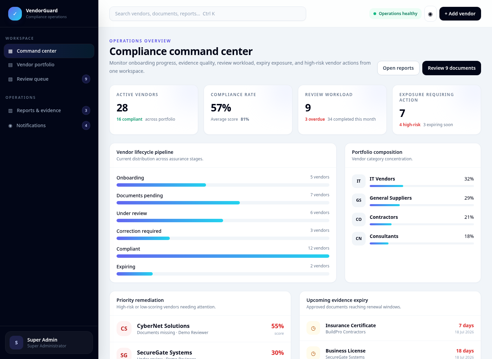
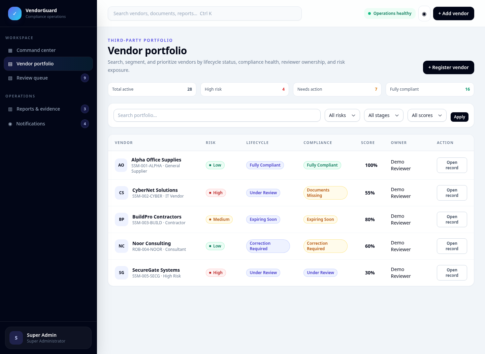
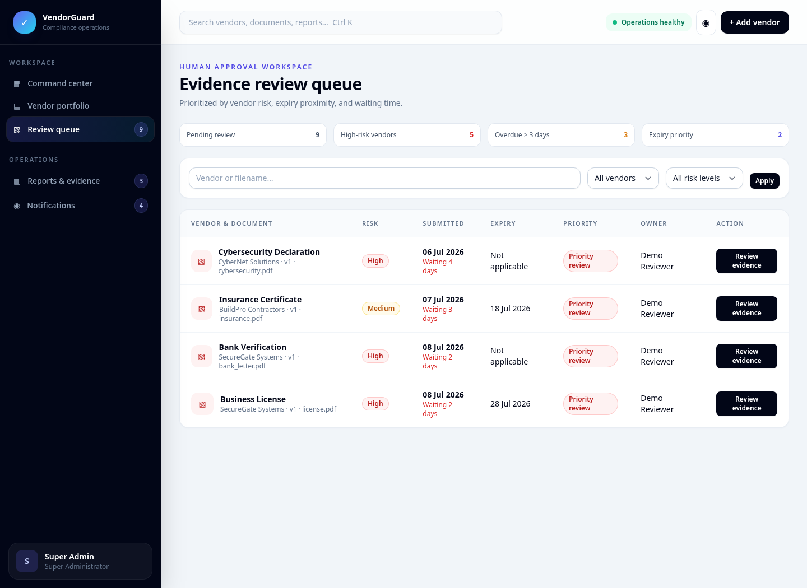
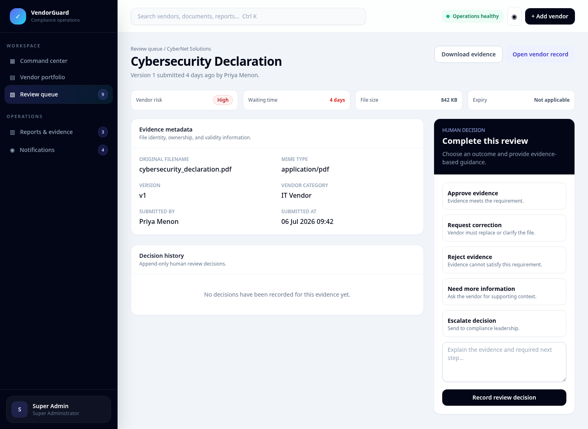
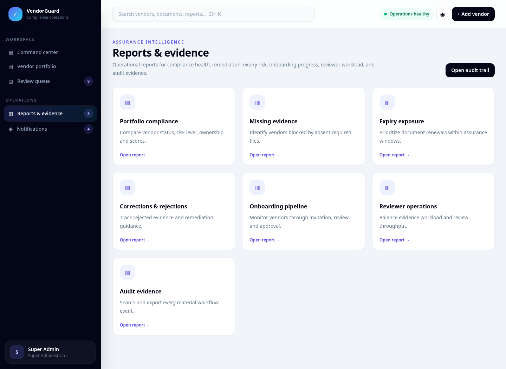
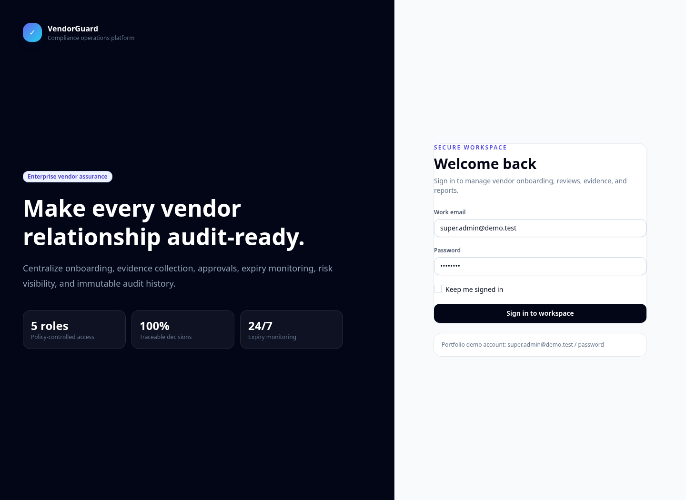

# VendorGuard — Vendor Compliance & Document Approval Portal

A production-style Laravel platform for vendor onboarding, compliance evidence collection, human document review, expiry monitoring, risk-based prioritization, reporting, notifications, and immutable audit history.

> VendorGuard centralizes the full assurance lifecycle: **vendor invited → evidence uploaded → reviewer decision → compliance recalculated → remediation tracked → reports and audit records retained**.

## Why this project exists

Vendor assurance is often managed through email threads, shared folders, and spreadsheets. That creates unclear ownership, inconsistent evidence decisions, missed expiry dates, and weak auditability. VendorGuard turns those fragmented activities into a controlled, role-aware workflow.

## Product capabilities

- Vendor onboarding and lifecycle management
- Category-specific required-document checklists
- Private evidence storage with authenticated downloads
- Document replacement and version history
- Risk levels and compliance scoring
- Human review queue with approve, reject, correction, information-request, and escalation outcomes
- Missing, rejected, under-review, expired, and expiring evidence detection
- Vendor remediation workflow
- Role-based operational dashboards
- In-app notification center
- CSV reporting and audit exports
- Scheduled expiry monitoring
- Append-only audit events
- Dockerized web, worker, scheduler, and MySQL services
- CI checks for PHP syntax, Laravel tests, frontend builds, and dependency auditing

## User roles

| Role | Primary responsibilities |
|---|---|
| Super Administrator | Platform-wide administration, vendor oversight, reporting, review access, and audit access |
| Compliance Administrator | Vendor onboarding, evidence requirements, reviewer assignment, remediation, and reports |
| Reviewer | Prioritized review queue, evidence inspection, and human review decisions |
| Vendor User | Vendor-scoped checklist, uploads, replacements, and decision feedback |
| Auditor | Read-only vendor assurance records, compliance evidence, and audit-log exports |

## Compliance workflow

```text
Vendor creation
    ↓
Category requirements assigned
    ↓
Vendor invitation and account acceptance
    ↓
Private evidence upload and version creation
    ↓
Risk-prioritized human review queue
    ↓
Approve / correction / reject / request information / escalate
    ↓
Compliance score and lifecycle status recalculated
    ↓
Expiry monitoring, notifications, reports, and audit trail
```

## Screenshots

### Compliance command center



### Vendor portfolio



### Risk-prioritized review queue



### Human review workspace



### Compliance reports



### Secure login



## Main workspaces

### Compliance command center

The operations dashboard surfaces:

- active and compliant vendors
- portfolio compliance rate and average score
- current and overdue review workload
- high-risk exposure requiring action
- vendor lifecycle distribution
- category concentration
- priority remediation vendors
- upcoming evidence expiry
- recent reviewer activity

### Vendor portfolio

Compliance teams can search and filter vendors by lifecycle, category, risk, and score band. Each vendor record includes contact details, reviewer ownership, required evidence, document history, compliance score, invitation state, and operational actions.

### Review workspace

Reviewers receive a queue ordered by risk and waiting time. Each evidence record exposes private metadata, version information, expiry, decision history, and controlled outcomes. Review comments are stored with the actor and timestamp.

### Vendor portal

Vendor users are restricted to their own organization. They can view required evidence, understand decision feedback, upload replacements, and download authorized versions without receiving public file URLs.

### Reports and auditability

The platform includes reports for compliance summary, missing evidence, expiry, rejected submissions, onboarding, reviewer workload, and audit history. CSV export endpoints support downstream assurance and governance workflows.

## Security design

- Role middleware and model policies enforce access boundaries.
- Vendor users are restricted by vendor-scoped middleware.
- Compliance files use a dedicated private storage disk.
- Files are delivered only through authorized controller actions.
- Upload requests validate size, extension, MIME type, and ownership.
- Lifecycle actions and decisions generate audit records.
- Forms use Laravel CSRF protection.
- Authentication sessions and passwords use Laravel security primitives.
- Production containers run PHP-FPM as a non-root application user.
- Nginx blocks access to hidden, storage, and cache paths.

## Technology stack

| Layer | Technology |
|---|---|
| Application | Laravel 12, PHP 8.2+ |
| Interface | Blade, Tailwind CSS, Vite, Axios |
| Authorization | Laravel middleware, policies, five-role RBAC |
| Database | SQLite for local setup; MySQL 8.4 in Docker |
| Documents | Laravel Filesystem private disk; S3-ready driver configuration |
| Reports | Native streamed CSV exports with immutable export audit events |
| Background operations | Database queue worker and Laravel scheduler |
| Infrastructure | Docker Compose, Nginx, PHP-FPM, MySQL |
| Quality | PHPUnit, Laravel Pint, PHP lint, npm audit, GitHub Actions |

## Project structure

```text
app/
├── Console/Commands/       # Expiry monitoring
├── Http/Controllers/       # Admin, reviewer, vendor, auditor, notifications
├── Http/Middleware/        # RBAC and vendor scoping
├── Http/Requests/          # Validated onboarding, upload, and review inputs
├── Models/                 # Vendor, evidence, versions, reviews, checks, logs
├── Policies/               # Resource authorization
└── Services/               # Compliance, documents, reviews, reports, audit

database/
├── factories/
├── migrations/
└── seeders/                # Document catalogue and controlled portfolio data

resources/
├── css/app.css             # VendorGuard design system
├── js/app.js               # Responsive navigation and interactions
└── views/                  # Role-aware operational workspaces

docs/screenshots/           # Portfolio screenshots
.github/workflows/ci.yml    # Automated verification
```

## Windows quick start

### Prerequisites

Install and add to PATH:

- PHP 8.2 or newer
- Composer 2 or newer
- Node.js 20 or newer

### First-time setup

Double-click:

```text
setup_windows.bat
```

The script creates a local SQLite environment, installs dependencies, generates the application key, migrates the database, and builds frontend assets.

Load the controlled portfolio dataset:

```text
seed_demo.bat
```

Start Laravel:

```text
start_laravel.bat
```

Start Vite in another terminal:

```text
start_vite.bat
```

Open:

```text
http://127.0.0.1:8000
```

## Manual local setup

```bash
git clone https://github.com/SAHARIARSHOWMIK/vendor-compliance-portal.git
cd vendor-compliance-portal

cp .env.sqlite.example .env
composer install
npm install

php artisan key:generate
mkdir -p database
touch database/database.sqlite
php artisan migrate
php artisan db:seed --class=DemoSeeder

npm run build
php artisan serve
```

For asset hot reloading, run `npm run dev` in another terminal.

## Demo accounts

All seeded accounts use the password `password`.

| Role | Email |
|---|---|
| Super Administrator | `super.admin@demo.test` |
| Compliance Administrator | `compliance.admin@demo.test` |
| Reviewer | `reviewer@demo.test` |
| Auditor | `auditor@demo.test` |
| Alpha Office Supplies | `vendor.alpha@demo.test` |
| CyberNet Solutions | `vendor.cybernet@demo.test` |
| BuildPro Contractors | `vendor.buildpro@demo.test` |
| Noor Consulting | `vendor.noor@demo.test` |
| SecureGate Systems | `vendor.securegate@demo.test` |

The seed data demonstrates compliant, missing-document, under-review, correction-required, rejected, high-risk, and expiring-evidence scenarios.

## Testing and quality checks

```bash
php artisan test
npm run build
npm audit --audit-level=high
```

On Windows:

```text
run_tests.bat
```

GitHub Actions performs dependency installation, SQLite environment preparation, PHP syntax validation, Laravel tests, a production frontend build, and a high-severity npm audit.

## Docker deployment

Create `.env` from `.env.example`, then set a valid application key:

```bash
cp .env.example .env
docker compose run --rm app php artisan key:generate --show
```

Copy the generated value into `APP_KEY`, then run:

```bash
docker compose build
docker compose up -d
docker compose exec app php artisan migrate --force
docker compose exec app php artisan db:seed --class=DemoSeeder --force
```

Open `http://localhost:8080`.

The Compose stack includes:

- Nginx web server
- PHP-FPM application
- MySQL 8.4 database
- queue worker
- Laravel scheduler
- persistent private-document and log volumes

## Configuration highlights

Important environment variables:

```dotenv
DOCUMENT_MAX_UPLOAD_SIZE_KB=10240
COMPLIANCE_EXPIRY_EARLY_WARNING_DAYS=60
COMPLIANCE_EXPIRY_REMINDER_DAYS=30
COMPLIANCE_EXPIRY_URGENT_DAYS=7
VENDOR_DOCUMENTS_DISK_DRIVER=local
```

To move private evidence to object storage, configure the dedicated disk for S3 and provide the required AWS variables. Application upload and download code continues to use the same `vendor_documents` disk abstraction.

## Automated expiry monitoring

The scheduler runs the compliance expiry command defined in `routes/console.php`. It identifies approaching or elapsed expiry dates, updates evidence and vendor states, and generates operational notifications.

Run manually:

```bash
php artisan compliance:check-expiry
```

## Repository safeguards

The repository intentionally excludes:

- `.env`
- private uploaded evidence
- SQLite database files
- Composer `vendor/`
- `node_modules/`
- compiled build output
- logs and caches

Only controlled sample records belong in public demonstrations.

## Current boundaries

- Real SMTP, S3, identity-provider, and enterprise SSO integrations require deployment credentials.
- The included roles are organization-wide; multi-tenant organization isolation can be added for a SaaS deployment.
- CSV export is implemented; PDF/Excel dependencies are present for expanded formatted reports.
- Screenshots use controlled sample records and contain no private vendor data.

## Resume highlights

**Vendor Compliance & Document Approval Portal**  
*Laravel, PHP, MySQL/SQLite, Tailwind CSS, RBAC, Docker*

- Built a full-stack Laravel portal for vendor onboarding, category-specific evidence checklists, private file uploads, version history, risk-prioritized review queues, and approval or correction workflows.
- Developed a compliance engine that tracks missing, rejected, under-review, expired, and expiring evidence; recalculates vendor scores; and generates operational notifications, reports, and audit records.
- Implemented five-role access control, vendor-scoped authorization, scheduled expiry monitoring, queue workers, CSV exports, Docker deployment, and automated CI verification.

## License

Released under the [MIT License](LICENSE).
